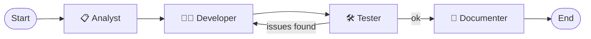

<div align="center">

# 🧑‍💻 Software Agentic AI

**A LangGraph multi-agent pipeline that turns a plain-English idea into requirements, code, a review and documentation.**


</div>

---

## ✨ Overview

Four cooperating AI agents, orchestrated with [LangGraph](https://langchain-ai.github.io/langgraph/), work like a small software team:

| Agent | Role |
|---|---|
| 📋 **Analyst** | Converts your request into clear software requirements |
| 👨‍💻 **Developer** | Writes the code from those requirements |
| 🛠️ **Tester** | Reviews the code; if problems are found the work goes back to the developer |
| 📄 **Documenter** | Summarizes everything into readable documentation with the final source code |



## 🧩 Two ways to run it

| File | Interface | Model |
|---|---|---|
| `app.py` | 💻 Terminal chat loop (type `q` or `exit` to quit) | Local **Ollama** (`llama3.2:1b`) |
| `stt.py` | 🌐 Streamlit web app with a live workflow diagram in the sidebar | **Groq** (`llama-3.3-70b-versatile`) |

`test1.py` is a small Tkinter + SQLite to-do app that serves as a sample of the kind of program the agents can produce.

## 🚀 Getting Started

### Prerequisites

- Python 3.10+
- A [Groq API key](https://console.groq.com/keys) (for the Streamlit app)
- [Ollama](https://ollama.com/) with `llama3.2:1b` pulled (for the terminal app)

### Install

```bash
git clone https://github.com/Arashomranpour/SoftwareAgenticAI.git
cd SoftwareAgenticAI
python -m venv .venv && source .venv/bin/activate   # Windows: .venv\Scripts\activate
pip install -r requirements.txt
```

### Configure

Create a `.env` file in the project root:

```env
GROQ_API_KEY=your_groq_key
```

### Run

```bash
# Web UI
streamlit run stt.py

# Terminal version
ollama pull llama3.2:1b
python app.py
```

## 🐳 Run with Docker

```bash
docker build -t software-agentic-ai .
docker run -p 8501:8501 -e GROQ_API_KEY=your_key software-agentic-ai
```

Open http://localhost:8501. The container runs the Streamlit app (`stt.py`); the terminal version (`app.py`) needs a local Ollama and is meant to be run directly with Python.

## 📁 Project Structure

```
.
├── app.py            # Terminal multi-agent workflow (Ollama)
├── stt.py            # Streamlit multi-agent workflow (Groq)
├── test1.py          # Sample to-do app (Tkinter + SQLite)
├── requirements.txt
└── LICENSE
```

## 🛠️ Tech Stack

`LangGraph` · `LangChain` · `Groq` · `Ollama` · `Streamlit` · `python-dotenv`

## 📄 License

Released under the [Apache 2.0 License](LICENSE).
